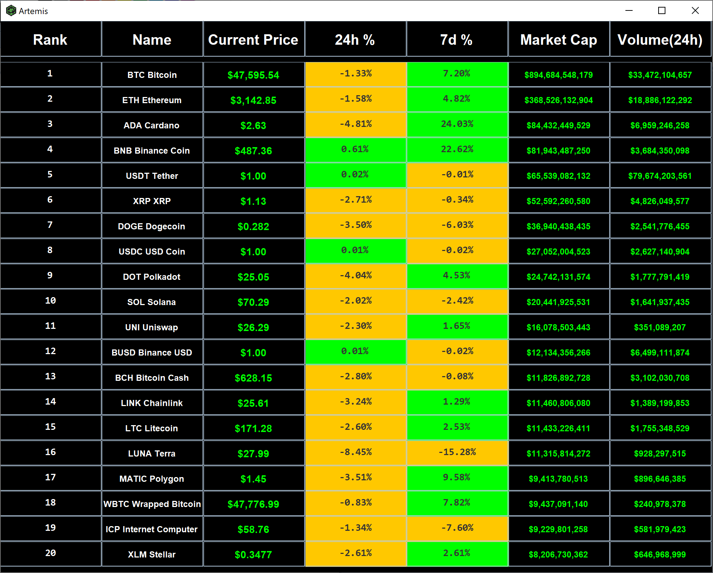

# Artemis
An application that helps users track and monitor crypto assets in timed intervals.

## Features
- Updates the graphical user interface once per minute to show fluctuations in the top 20 crypto assets.

## Inspiration
This application was inspired by an interest to track changes in cryptocurrencies in order to analyze data and evaluate personal financial investments.

## How I designed it
I sketched and structured the graphical user interface using a pencil blueprint which was then implemented using Swing GUI widget toolkit.
I used jsoup, a Java HTML parser, to scrape web data from CoinMarketCap which was then updated onto the GUI.
I implemented the Model-view-controller design pattern to separate the business logic from the front-end user interface.
Artemis updates its statistics panel once every minute to sync with the target website refresh rate.

## Challenges encountered
I encountered challenges when I tried to scrape the correct HTML element from the target website. My two methods for finding the correct HTML element that contains specified data was to use Inspect Element (CTRL-SHIFT-I) or to download an ad-block extension with inspect element properties called uBlock Origin.

## What I learned
I learned how to use jsoup to scrape web data and how to build a graphical user interface using Swing. In addition, I learned how to implement the Model-view-controller design pattern in order to separate the logic and GUI.
